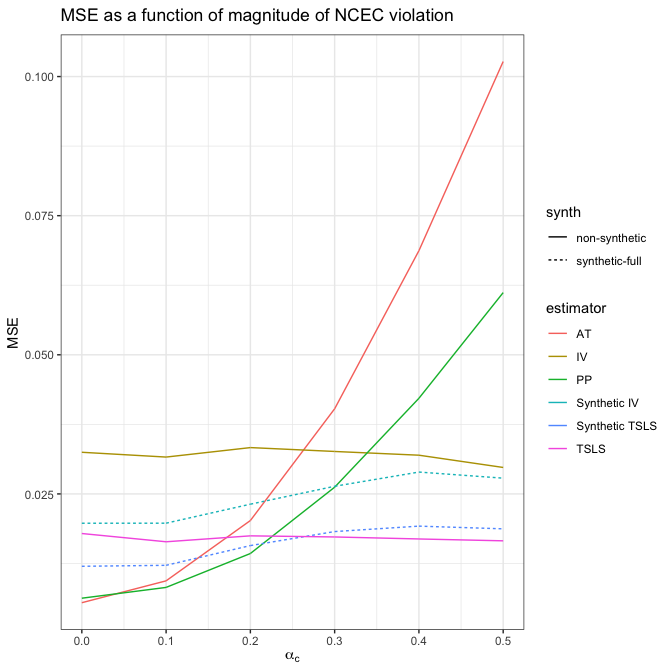
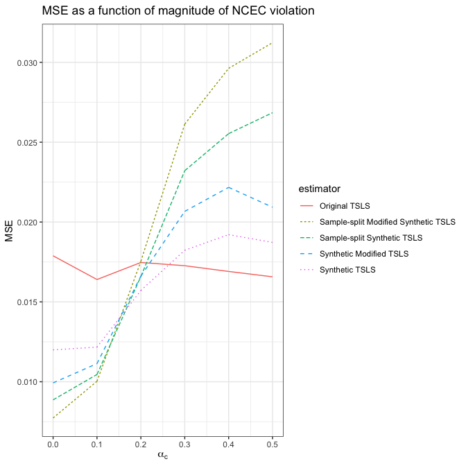

Compliance plots
================
dagniel
2019-05-15

``` r
library(knitr)
opts_chunk$set(warning = FALSE, message = FALSE, cache = FALSE, fig.width = 7, fig.height = 7)
```

``` r
library(tidyverse)
library(patchwork)
library(glue)
library(here)
res_sum <- readRDS(here('results/results_2018_09_18_summary.rds'))


res <- res_sum %>%
  filter(alpha_n == 0,
         # alpha_c == 0.5,
         gamma_n == 0,
         gamma_c == 0,
         lambda_n == 1,
         lambda_c == 1,
         compliance_effect == 2,
         # compliance_p == 0.7,
         # n == 1000,
         # !shrunk,
         !(synthetic & theta_0 %in% c('atregr_est', 'ppregr_est')))
res <- res %>%
  mutate(g = paste0(theta_0, shrunk, sample, synthetic, shrunk),
         synth = case_when(
           sample == 'CV' & synthetic & !shrunk ~ 'synthetic-CV',
           sample == 'full' & synthetic & !shrunk ~ 'synthetic-full',
           sample == 'CV' & synthetic  & shrunk ~ 'synthetic-CV-shrunk',
           sample == 'full' & synthetic & shrunk ~ 'synthetic-full-shrunk',
           TRUE ~ 'non-synthetic'
         ))
```

``` r
## gamma_c = 0
## lambda_n = 1
## lambda_c = 1
## compliance_effect = 2
## n = 200
## compliance_p = 0.6
```

``` r
## comparing synthetic vs regular
```

``` r
this_res <- res %>%
  filter(synth %in% c('non-synthetic', 'synthetic-full'),
         n == 200, compliance_p == 0.6) %>%
  mutate(estimator =
           case_when(
             synth == 'non-synthetic' ~ case_when(
               theta_0 == 'atregr_est' ~ 'AT',
               theta_0 == 'iv_est' ~ 'IV',
               theta_0 == 'ppregr_est' ~ 'PP',
               theta_0 == 'tsls_est' ~ 'TSLS'
             ),
             theta_0 == 'iv_est' ~ 'Synthetic IV',
             theta_0 == 'tsls_est' ~ 'Synthetic TSLS'
           ))

mse_pl <- ggplot(this_res,
       aes(x = alpha_c, y = mse, group = estimator, color = estimator, linetype = synth)) +
  geom_line() +
  theme_bw() +
  # scale_y_log10() +
  labs(x = expression(alpha[c]), y = 'MSE') +
  ggtitle(expression('MSE as a function of magnitude of NCEC violation'))

bias_pl <- ggplot(this_res,
       aes(x = alpha_c, y = bias, group = estimator, color = estimator, linetype = synth)) +
  geom_line() +
  theme_bw() +
  # scale_y_log10() +
  labs(x = expression(alpha[c]), y = 'Bias') +
  ggtitle(expression('Bias as a function of magnitude of NCEC violation'))

var_pl <- ggplot(this_res,
       aes(x = alpha_c, y = var, group = estimator, color = estimator, linetype = synth)) +
  geom_line() +
  theme_bw() +
  # scale_y_log10() +
  labs(x = expression(alpha[c]), y = 'Variance') +
  ggtitle(expression('Variance as a function of magnitude of NCEC violation'))

final_pl <- mse_pl + bias_pl + var_pl + plot_layout(ncol = 1)
ggsave(here('figures/synthetic-vs-others-plot.png'), height = 8, width = 8, plot = final_pl)
ggsave(here('figures/synthetic-vs-others-plot.pdf'), height = 8, width = 8, plot = final_pl)
ggsave(here('figures/synthetic-vs-others-plot.eps'), height = 8, width = 8, plot = final_pl)
```

``` r
## comparing CV vs regular synthetic
```

``` r
this_res <- res %>%
  filter(#synth %in% c('non-synthetic', 'synthetic-full', 'synthetic-CV'),
         !(synthetic & theta_0 == 'iv_est'),
         n == 200, compliance_p == 0.6,
         theta_0 == 'tsls_est') %>%
  mutate(estimator =
           case_when(
             synth == 'non-synthetic' ~ case_when(
               theta_0 == 'atregr_est' ~ 'AT',
               theta_0 == 'iv_est' ~ 'IV',
               theta_0 == 'ppregr_est' ~ 'PP',
               theta_0 == 'tsls_est' ~ 'Original TSLS'
             ),
             synth == 'synthetic-CV' ~ 'Sample-split Synthetic TSLS',
             synth == 'synthetic-full' ~ 'Synthetic TSLS',
             synth == 'synthetic-CV-shrunk' ~ 'Sample-split Modified Synthetic TSLS',
             synth == 'synthetic-full-shrunk' ~ 'Synthetic Modified TSLS'
           ))

mse_pl <- ggplot(this_res,
                 aes(x = alpha_c, y = mse, group = estimator, color = estimator, linetype = estimator)) +
  geom_line() +
  theme_bw() +
  # scale_y_log10() +
  labs(x = expression(alpha[c]), y = 'MSE') +
  ggtitle(expression('MSE as a function of magnitude of NCEC violation'))

bias_pl <- ggplot(this_res,
                  aes(x = alpha_c, y = bias, group = estimator, color = estimator, linetype = estimator)) +
  geom_line() +
  theme_bw() +
  # scale_y_log10() +
  labs(x = expression(alpha[c]), y = 'Bias') +
  ggtitle(expression('Bias as a function of magnitude of NCEC violation'))

var_pl <- ggplot(this_res,
                 aes(x = alpha_c, y = var, group = estimator, color = estimator, linetype = estimator)) +
  geom_line() +
  theme_bw() +
  # scale_y_log10() +
  labs(x = expression(alpha[c]), y = 'Variance') +
  ggtitle(expression('Variance as a function of magnitude of NCEC violation'))
final_pl <- mse_pl + bias_pl + var_pl + plot_layout(ncol = 1)
ggsave(here('figures/synthetics-compare-plot.png'), height = 8, width = 8, plot = final_pl)
ggsave(here('figures/synthetics-compare-plot.pdf'), height = 8, width = 8, plot = final_pl)

ggsave(here('figures/synthetics-compare-plot.eps'), height = 8, width = 8, plot = final_pl)


sim <- res_sum %>%
  ungroup %>%
  filter(lambda_n == lambda_c, gamma_c == 0,
         n == 1000, lambda_n == 1, lambda_c == 1,
         alpha_n == 0, gamma_n == 0, compliance_p == 0.5,
         compliance_effect == 0.5) %>%
  select(n, lambda_n, lambda_c, alpha_n, gamma_n, gamma_c, compliance_p, compliance_effect)
knitr::kable(sim)
```

|     n|  lambda\_n|  lambda\_c|  alpha\_n|  gamma\_n|  gamma\_c|  compliance\_p|  compliance\_effect|
|-----:|----------:|----------:|---------:|---------:|---------:|--------------:|-------------------:|
|  1000|          1|          1|         0|         0|         0|            0.5|                 0.5|
|  1000|          1|          1|         0|         0|         0|            0.5|                 0.5|
|  1000|          1|          1|         0|         0|         0|            0.5|                 0.5|
|  1000|          1|          1|         0|         0|         0|            0.5|                 0.5|
|  1000|          1|          1|         0|         0|         0|            0.5|                 0.5|
|  1000|          1|          1|         0|         0|         0|            0.5|                 0.5|
|  1000|          1|          1|         0|         0|         0|            0.5|                 0.5|
|  1000|          1|          1|         0|         0|         0|            0.5|                 0.5|
|  1000|          1|          1|         0|         0|         0|            0.5|                 0.5|
|  1000|          1|          1|         0|         0|         0|            0.5|                 0.5|
|  1000|          1|          1|         0|         0|         0|            0.5|                 0.5|
|  1000|          1|          1|         0|         0|         0|            0.5|                 0.5|
|  1000|          1|          1|         0|         0|         0|            0.5|                 0.5|
|  1000|          1|          1|         0|         0|         0|            0.5|                 0.5|
|  1000|          1|          1|         0|         0|         0|            0.5|                 0.5|
|  1000|          1|          1|         0|         0|         0|            0.5|                 0.5|
|  1000|          1|          1|         0|         0|         0|            0.5|                 0.5|
|  1000|          1|          1|         0|         0|         0|            0.5|                 0.5|
|  1000|          1|          1|         0|         0|         0|            0.5|                 0.5|
|  1000|          1|          1|         0|         0|         0|            0.5|                 0.5|
|  1000|          1|          1|         0|         0|         0|            0.5|                 0.5|
|  1000|          1|          1|         0|         0|         0|            0.5|                 0.5|
|  1000|          1|          1|         0|         0|         0|            0.5|                 0.5|
|  1000|          1|          1|         0|         0|         0|            0.5|                 0.5|
|  1000|          1|          1|         0|         0|         0|            0.5|                 0.5|
|  1000|          1|          1|         0|         0|         0|            0.5|                 0.5|
|  1000|          1|          1|         0|         0|         0|            0.5|                 0.5|
|  1000|          1|          1|         0|         0|         0|            0.5|                 0.5|
|  1000|          1|          1|         0|         0|         0|            0.5|                 0.5|
|  1000|          1|          1|         0|         0|         0|            0.5|                 0.5|
|  1000|          1|          1|         0|         0|         0|            0.5|                 0.5|
|  1000|          1|          1|         0|         0|         0|            0.5|                 0.5|
|  1000|          1|          1|         0|         0|         0|            0.5|                 0.5|
|  1000|          1|          1|         0|         0|         0|            0.5|                 0.5|
|  1000|          1|          1|         0|         0|         0|            0.5|                 0.5|
|  1000|          1|          1|         0|         0|         0|            0.5|                 0.5|
|  1000|          1|          1|         0|         0|         0|            0.5|                 0.5|
|  1000|          1|          1|         0|         0|         0|            0.5|                 0.5|
|  1000|          1|          1|         0|         0|         0|            0.5|                 0.5|
|  1000|          1|          1|         0|         0|         0|            0.5|                 0.5|
|  1000|          1|          1|         0|         0|         0|            0.5|                 0.5|
|  1000|          1|          1|         0|         0|         0|            0.5|                 0.5|
|  1000|          1|          1|         0|         0|         0|            0.5|                 0.5|
|  1000|          1|          1|         0|         0|         0|            0.5|                 0.5|
|  1000|          1|          1|         0|         0|         0|            0.5|                 0.5|
|  1000|          1|          1|         0|         0|         0|            0.5|                 0.5|
|  1000|          1|          1|         0|         0|         0|            0.5|                 0.5|
|  1000|          1|          1|         0|         0|         0|            0.5|                 0.5|
|  1000|          1|          1|         0|         0|         0|            0.5|                 0.5|
|  1000|          1|          1|         0|         0|         0|            0.5|                 0.5|
|  1000|          1|          1|         0|         0|         0|            0.5|                 0.5|
|  1000|          1|          1|         0|         0|         0|            0.5|                 0.5|
|  1000|          1|          1|         0|         0|         0|            0.5|                 0.5|
|  1000|          1|          1|         0|         0|         0|            0.5|                 0.5|
|  1000|          1|          1|         0|         0|         0|            0.5|                 0.5|
|  1000|          1|          1|         0|         0|         0|            0.5|                 0.5|
|  1000|          1|          1|         0|         0|         0|            0.5|                 0.5|
|  1000|          1|          1|         0|         0|         0|            0.5|                 0.5|
|  1000|          1|          1|         0|         0|         0|            0.5|                 0.5|
|  1000|          1|          1|         0|         0|         0|            0.5|                 0.5|
|  1000|          1|          1|         0|         0|         0|            0.5|                 0.5|
|  1000|          1|          1|         0|         0|         0|            0.5|                 0.5|
|  1000|          1|          1|         0|         0|         0|            0.5|                 0.5|
|  1000|          1|          1|         0|         0|         0|            0.5|                 0.5|
|  1000|          1|          1|         0|         0|         0|            0.5|                 0.5|
|  1000|          1|          1|         0|         0|         0|            0.5|                 0.5|
|  1000|          1|          1|         0|         0|         0|            0.5|                 0.5|
|  1000|          1|          1|         0|         0|         0|            0.5|                 0.5|
|  1000|          1|          1|         0|         0|         0|            0.5|                 0.5|
|  1000|          1|          1|         0|         0|         0|            0.5|                 0.5|
|  1000|          1|          1|         0|         0|         0|            0.5|                 0.5|
|  1000|          1|          1|         0|         0|         0|            0.5|                 0.5|
|  1000|          1|          1|         0|         0|         0|            0.5|                 0.5|
|  1000|          1|          1|         0|         0|         0|            0.5|                 0.5|
|  1000|          1|          1|         0|         0|         0|            0.5|                 0.5|
|  1000|          1|          1|         0|         0|         0|            0.5|                 0.5|
|  1000|          1|          1|         0|         0|         0|            0.5|                 0.5|
|  1000|          1|          1|         0|         0|         0|            0.5|                 0.5|
|  1000|          1|          1|         0|         0|         0|            0.5|                 0.5|
|  1000|          1|          1|         0|         0|         0|            0.5|                 0.5|
|  1000|          1|          1|         0|         0|         0|            0.5|                 0.5|
|  1000|          1|          1|         0|         0|         0|            0.5|                 0.5|
|  1000|          1|          1|         0|         0|         0|            0.5|                 0.5|
|  1000|          1|          1|         0|         0|         0|            0.5|                 0.5|
|  1000|          1|          1|         0|         0|         0|            0.5|                 0.5|
|  1000|          1|          1|         0|         0|         0|            0.5|                 0.5|
|  1000|          1|          1|         0|         0|         0|            0.5|                 0.5|
|  1000|          1|          1|         0|         0|         0|            0.5|                 0.5|
|  1000|          1|          1|         0|         0|         0|            0.5|                 0.5|
|  1000|          1|          1|         0|         0|         0|            0.5|                 0.5|
|  1000|          1|          1|         0|         0|         0|            0.5|                 0.5|
|  1000|          1|          1|         0|         0|         0|            0.5|                 0.5|
|  1000|          1|          1|         0|         0|         0|            0.5|                 0.5|
|  1000|          1|          1|         0|         0|         0|            0.5|                 0.5|
|  1000|          1|          1|         0|         0|         0|            0.5|                 0.5|
|  1000|          1|          1|         0|         0|         0|            0.5|                 0.5|
|  1000|          1|          1|         0|         0|         0|            0.5|                 0.5|
|  1000|          1|          1|         0|         0|         0|            0.5|                 0.5|
|  1000|          1|          1|         0|         0|         0|            0.5|                 0.5|
|  1000|          1|          1|         0|         0|         0|            0.5|                 0.5|
|  1000|          1|          1|         0|         0|         0|            0.5|                 0.5|
|  1000|          1|          1|         0|         0|         0|            0.5|                 0.5|
|  1000|          1|          1|         0|         0|         0|            0.5|                 0.5|
|  1000|          1|          1|         0|         0|         0|            0.5|                 0.5|
|  1000|          1|          1|         0|         0|         0|            0.5|                 0.5|
|  1000|          1|          1|         0|         0|         0|            0.5|                 0.5|
|  1000|          1|          1|         0|         0|         0|            0.5|                 0.5|
|  1000|          1|          1|         0|         0|         0|            0.5|                 0.5|
|  1000|          1|          1|         0|         0|         0|            0.5|                 0.5|
|  1000|          1|          1|         0|         0|         0|            0.5|                 0.5|
|  1000|          1|          1|         0|         0|         0|            0.5|                 0.5|
|  1000|          1|          1|         0|         0|         0|            0.5|                 0.5|
|  1000|          1|          1|         0|         0|         0|            0.5|                 0.5|
|  1000|          1|          1|         0|         0|         0|            0.5|                 0.5|
|  1000|          1|          1|         0|         0|         0|            0.5|                 0.5|
|  1000|          1|          1|         0|         0|         0|            0.5|                 0.5|
|  1000|          1|          1|         0|         0|         0|            0.5|                 0.5|
|  1000|          1|          1|         0|         0|         0|            0.5|                 0.5|
|  1000|          1|          1|         0|         0|         0|            0.5|                 0.5|
|  1000|          1|          1|         0|         0|         0|            0.5|                 0.5|

``` r
res <-  sim %>% inner_join(res_sum) %>%
  filter(
    !(synthetic & theta_0 %in% c('atregr_est', 'ppregr_est')))
res <- res %>%
  mutate(g = paste0(theta_0, shrunk, sample, synthetic, shrunk),
         synth = case_when(
           sample == 'CV' & synthetic & !shrunk ~ 'synthetic-CV',
           sample == 'full' & synthetic & !shrunk ~ 'synthetic-full',
           sample == 'CV' & synthetic  & shrunk ~ 'synthetic-CV-shrunk',
           sample == 'full' & synthetic & shrunk ~ 'synthetic-full-shrunk',
           TRUE ~ 'non-synthetic'
         ))

this_res <- res %>%
  filter(synth %in% c('non-synthetic', 'synthetic-full')) %>%
  mutate(estimator =
           case_when(
             synth == 'non-synthetic' ~ case_when(
               theta_0 == 'atregr_est' ~ 'AT',
               theta_0 == 'iv_est' ~ 'IV',
               theta_0 == 'ppregr_est' ~ 'PP',
               theta_0 == 'tsls_est' ~ 'TSLS'
             ),
             theta_0 == 'iv_est' ~ 'Synthetic IV',
             theta_0 == 'tsls_est' ~ 'Synthetic TSLS'
           ))

mse_pl1 <- ggplot(this_res,
                 aes(x = alpha_c, y = mse, group = estimator, color = estimator, linetype = synth)) +
  geom_line() +
  theme_bw() +
  # scale_y_log10() +
  labs(x = expression(alpha[c]), y = 'MSE') +
  ggtitle(expression('MSE as a function of magnitude of NCEC violation'))
mse_pl1
```



``` r
this_res <- res %>%
  filter(#synth %in% c('non-synthetic', 'synthetic-full', 'synthetic-CV'),
    !(synthetic & theta_0 == 'iv_est'),
    theta_0 == 'tsls_est') %>%
  mutate(estimator =
           case_when(
             synth == 'non-synthetic' ~ case_when(
               theta_0 == 'atregr_est' ~ 'AT',
               theta_0 == 'iv_est' ~ 'IV',
               theta_0 == 'ppregr_est' ~ 'PP',
               theta_0 == 'tsls_est' ~ 'Original TSLS'
             ),
             synth == 'synthetic-CV' ~ 'Sample-split Synthetic TSLS',
             synth == 'synthetic-full' ~ 'Synthetic TSLS',
             synth == 'synthetic-CV-shrunk' ~ 'Sample-split Modified Synthetic TSLS',
             synth == 'synthetic-full-shrunk' ~ 'Synthetic Modified TSLS'
           ))
mse_pl2 <- ggplot(this_res,
                 aes(x = alpha_c, y = mse, group = estimator, color = estimator, linetype = estimator)) +
  geom_line() +
  theme_bw() +
  # scale_y_log10() +
  labs(x = expression(alpha[c]), y = 'MSE') +
  ggtitle(expression('MSE as a function of magnitude of NCEC violation'))
mse_pl2
```



``` r
final_pl <- mse_pl1 + mse_pl2 + plot_layout(ncol = 1)
ggsave(here('figures/additional-mse-plot.png'), height = 8, width = 8, plot = final_pl)
ggsave(here('figures/additional-mse-plot.pdf'), height = 8, width = 8, plot = final_pl)

ggsave(here('figures/additional-mse-plot.eps'), height = 8, width = 8, plot = final_pl)
```
