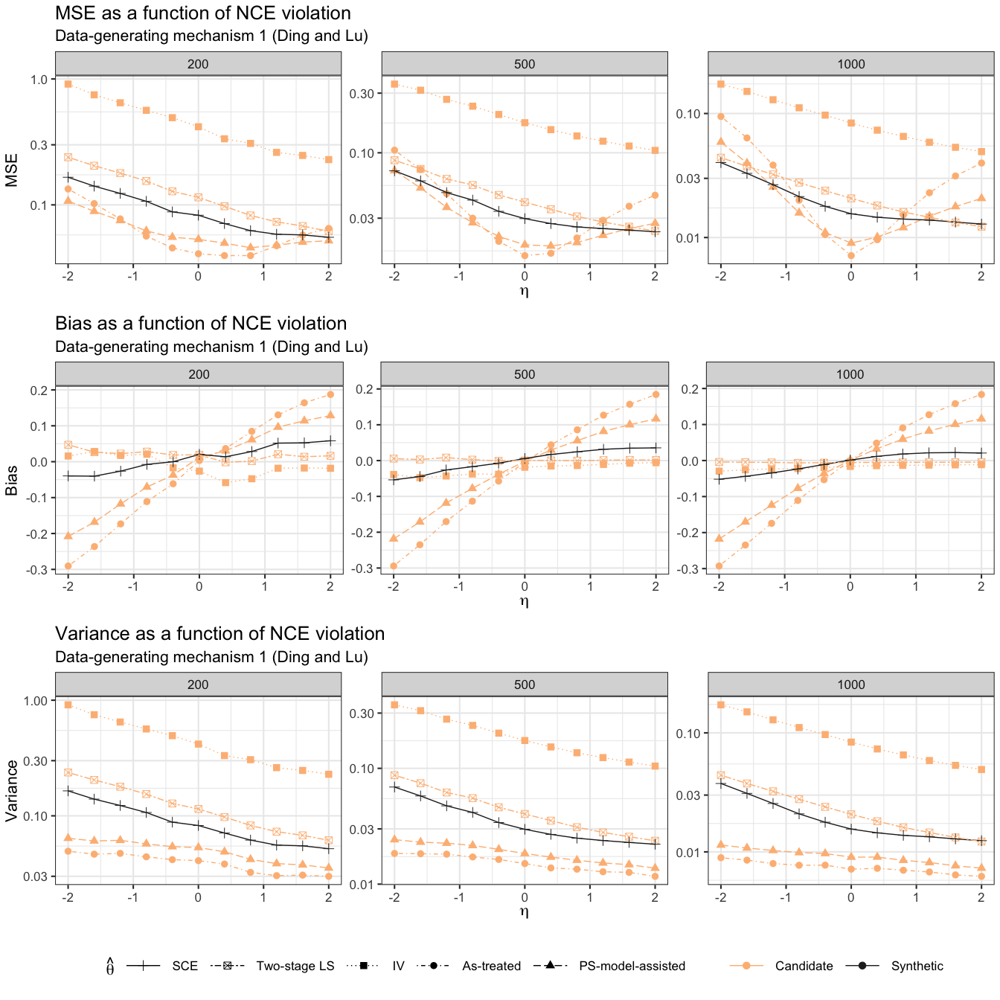
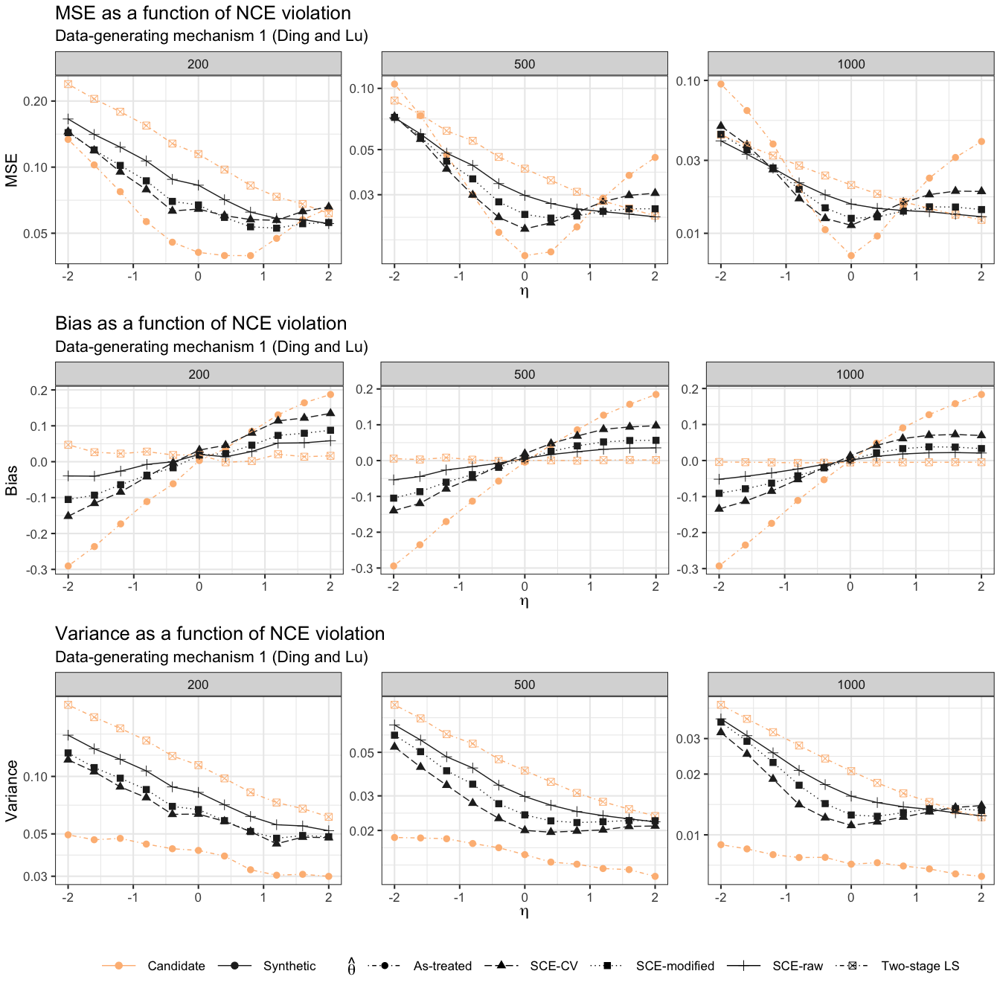

Compliance plots
================
dagniel
2019-06-21

``` r
library(knitr)
opts_chunk$set(warning = FALSE, message = FALSE, cache = FALSE, fig.width = 14, fig.height = 14)
```

``` r
library(tidyverse)
library(here)
library(glue)
library(patchwork)

secondary_res <- readRDS(here(
  'results/secondary-compliance-sim-results.rds'
)) %>%
  keep(is.data.frame) %>%
  bind_rows %>%
  filter(theta_0 != 'ivs_est')

sec_sum <- secondary_res %>%
  group_by(theta_0, shrunk, sample, synthetic, n, theta) %>%
  summarise(
    bias = mean(estimate - 1, na.rm = TRUE),
    est_var = mean(var, na.rm = TRUE),
    var = var(estimate, na.rm = TRUE),
    mse = mean((estimate - 1)^2, na.rm = TRUE),
    ci_cov = mean(estimate - 1.96*sqrt(var) < 1 &
      estimate + 1.96*sqrt(var) > 1),
    n_NA = sum(is.na(estimate))
  ) %>%
  ungroup


cv_compare <- sec_sum %>%
  filter((synthetic & theta_0 %in% c('tsls_est') & !shrunk) | 
           !synthetic & theta_0 %in% c('atregr_est',
                                       'ipw_regr_est',
                                       'iv_est',
                                       'tsls_est'),
         sample != 'CV') %>%
  mutate(name = 
           case_when(synthetic ~ 'SCE',
                     TRUE ~ theta_0))
bias_pl <- ggplot(cv_compare,
       aes(x = theta, y = bias, group = name, 
           linetype = name,
           shape = name,
           color = synthetic)) +
  geom_point(size = 3) +
  geom_line() + 
  theme_bw(base_size = 16) +
  ggtitle('Bias as a function of NCE violation',
          subtitle = 'Data-generating mechanism 1 (Ding and Lu)') +
  labs(x = expression(eta), y = 'Bias') +
  scale_linetype_manual(expression(hat(theta)),
                          breaks = c('SCE',
                                     'tsls_est',
                                     'iv_est',
                                     'atregr_est',
                                     'ipw_regr_est'),
                          labels = c('SCE',
                                     'Two-stage LS',
                                     'IV',
                                     'As-treated', 
                                     'PS-model-assisted'),
                        values = c('dotdash',
                                   'longdash',
                                   'dotted',
                                   'solid',
                                   'twodash')) +
  scale_shape_discrete(expression(hat(theta)),
                          breaks = c('SCE',
                                     'tsls_est',
                                     'iv_est',
                                     'atregr_est',
                                     'ipw_regr_est'),
                          labels = c('SCE',
                                     'Two-stage LS',
                                     'IV',
                                     'As-treated', 
                                     'PS-model-assisted')) +
  facet_wrap(~ n, scales = 'free') +
  scale_color_manual('',
                   breaks = c(FALSE, TRUE),
                   labels = c('Candidate', 'Synthetic'),
                   values = c('#fdbb84','#252525')
                   ) +
  theme(legend.position = 'none', legend.key.size = unit(1.5, 'cm'))
mse_pl <- bias_pl + aes(y = mse) +
  ggtitle('MSE as a function of NCE violation') +
  labs(y = 'MSE') +
  scale_y_log10()+
  theme(legend.position = 'none')
var_pl <- bias_pl + aes(y = var) +
  ggtitle('Variance as a function of NCE violation') +
  labs(y = 'Variance') + 
  scale_y_log10()+
  theme(legend.position = 'bottom')

full_pl <- mse_pl + bias_pl + var_pl + plot_layout(ncol = 1)
full_pl
```



``` r
ggsave(here('figures/secondary-sim-mse-plot.png'),
       height = 16, width = 16)
```

Compare the different synthetic estimators.

``` r
compare_synths <- 
  sec_sum %>%
  filter(theta_0 == 'tsls_est' | (theta_0 == 'atregr_est' & !synthetic),
         !(sample == 'CV' & shrunk)) %>%
  mutate(name = case_when(
    theta_0 == 'atregr_est' ~ 'As-treated',
    !synthetic ~ 'Two-stage LS',
                          sample == 'CV' ~ 'SCE-CV',
                          shrunk ~ 'SCE-modified',
                          TRUE ~ 'SCE-raw'))
bias_pl <- ggplot(compare_synths,
                  aes(x = theta, y = bias, group = name, 
                      linetype = name,
                      shape = name,
                      color = synthetic)) +
  geom_point(size = 3) +
  geom_line() + 
  theme_bw(base_size = 16) +
  ggtitle('Bias as a function of NCE violation',
          subtitle = 'Data-generating mechanism 1 (Ding and Lu)') +
  labs(x = expression(eta), y = 'Bias') +
  scale_linetype_manual(expression(hat(theta)),
                        values = c('dotdash',
                                   'longdash',
                                   'dotted',
                                   'solid',
                                   'dotdash')) +
  scale_shape_discrete(expression(hat(theta))) +
  facet_wrap(~ n, scales = 'free')+
  scale_color_manual('',
                     breaks = c(FALSE, TRUE),
                     labels = c('Candidate', 'Synthetic'),
                     values = c('#fdbb84','#252525')
  ) +
  theme(legend.position = 'none', legend.key.size = unit(1.5, 'cm'))
mse_pl <- bias_pl + aes(y = mse) +
  ggtitle('MSE as a function of NCE violation') +
  labs(y = 'MSE') +
  scale_y_log10()
var_pl <- bias_pl + aes(y = var) +
  ggtitle('Variance as a function of NCE violation') +
  labs(y = 'Variance') + 
  scale_y_log10() +
  theme(legend.position= 'bottom')

full_pl <- mse_pl + bias_pl + var_pl + plot_layout(ncol = 1)
full_pl
```



``` r
ggsave(here('figures/secondary-sim-synth-compare-plot.png'),
       height = 16, width = 16)
```
