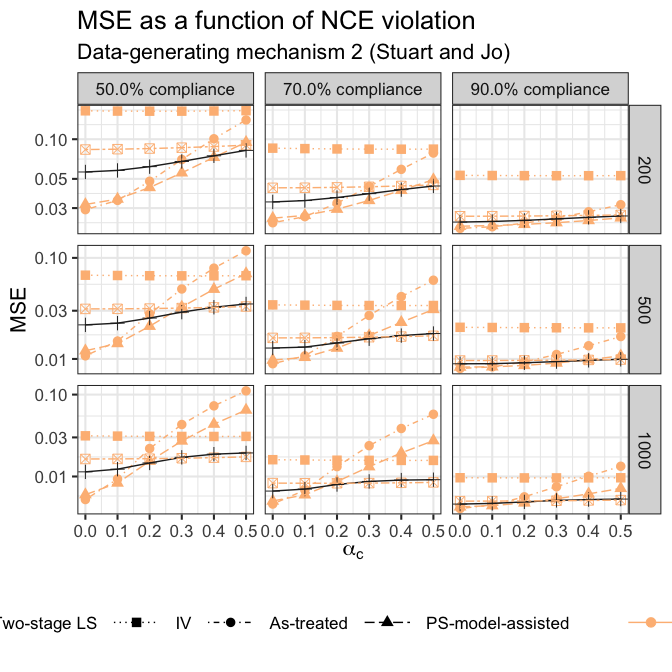

Compliance main sim results
================
dagniel
2019-06-21

``` r
library(knitr)
opts_chunk$set(warning = FALSE, message = FALSE, cache = FALSE, fig.width = 7, fig.height = 7)
```

``` r
library(tidyverse)
library(glue)
library(here)

sim_res <- readRDS(here(
  'results/compliance-main-sim-summary.rds'
)) %>%
  filter(theta_0 != 'ivs_est')

res <- sim_res %>%
  filter(
         gamma_n == 0,
         gamma_c == 0,
         lambda_n == 1,
         lambda_c == 1) %>%
  filter((synthetic & theta_0 %in% c('tsls_est') & !shrunk) | 
           !synthetic & theta_0 %in% c('atregr_est',
                                       'ipw_regr_est',
                                       'iv_est',
                                       'tsls_est'),
         sample != 'CV') %>%
  mutate(name = 
           case_when(synthetic ~ 'SCE',
                     TRUE ~ theta_0))
```

``` r
## gamma_c = 0
## lambda_n = 1
## lambda_c = 1
## compliance_effect = 2
## n = 200
## compliance_p = 0.6
```

``` r
## comparing synthetic vs regular
```

``` r
mse_pl <- ggplot(res,
                  aes(x = alpha_c, y = mse, group = name, 
                      linetype = name,
                      shape = name,
                      color = synthetic)) +
  geom_point(size = 3) +
  geom_line() + 
  theme_bw(base_size = 16) +
  ggtitle('MSE as a function of NCE violation',
          subtitle = 'Data-generating mechanism 2 (Stuart and Jo)') +
  labs(x = expression(alpha[c]), y = 'MSE') +
  scale_linetype_manual(expression(hat(theta)),
                        breaks = c('SCE',
                                   'tsls_est',
                                   'iv_est',
                                   'atregr_est',
                                   'ipw_regr_est'),
                        labels = c('SCE',
                                   'Two-stage LS',
                                   'IV',
                                   'As-treated', 
                                   'PS-model-assisted'),
                        values = c('dotdash',
                                   'longdash',
                                   'dotted',
                                   'solid',
                                   'twodash')) +
  scale_shape_discrete(expression(hat(theta)),
                       breaks = c('SCE',
                                  'tsls_est',
                                  'iv_est',
                                  'atregr_est',
                                  'ipw_regr_est'),
                       labels = c('SCE',
                                  'Two-stage LS',
                                  'IV',
                                  'As-treated', 
                                  'PS-model-assisted')) +
  facet_grid(compliance_p ~ n, scales = 'free') +
  scale_color_manual('',
                     breaks = c(FALSE, TRUE),
                     labels = c('Candidate', 'Synthetic'),
                     values = c('#fdbb84','#252525')
  ) +
  theme(legend.position = 'bottom', legend.key.size = unit(1.5, 'cm')) +
  scale_y_log10()
mse_pl
```



``` r
# mse_pl <- ggplot(this_res,
#                  aes(x = alpha_c, y = mse, group = g, linetype = theta_0, color = synth)) +
#   geom_line() +
#   geom_point() +
#   theme_bw(base_size = 16) +
#   # scale_y_log10() +
#   labs(x = expression(alpha[c]), y = 'MSE') +
#   ggtitle(expression('MSE as a function of NCE violation'),
#           subtitle = 'Simulation 1, by sample size and compliance proportion') +
#   scale_color_grey('', end = 0.75) +
#   scale_linetype_discrete(expression(hat(theta)),
#                           labels = c('As-treated', 
#                                      'PS-model-assisted',
#                                      'IV', 'Per-protocol',
#                                      'Two-stage LS')) +
#   facet_grid(compliance_p ~ n, scales = 'free')
# 
# mse_pl
ggsave(here('figures/main-sim-mse-plot.png'),
       height = 16, width = 16)
```
